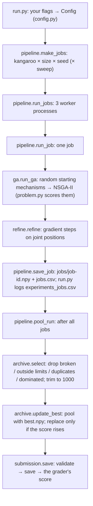

# 2.156 — ps1
September 2026. MIT. 2.156

Fatak Borhani, Joel Pederson, & Leif Akerley

**PS1 objective:** Design a linkage mechanism that can trace a target curve whilst minimizing material usage and complexity.

## Prerequisites

- **A conda installer.** [Miniforge](https://github.com/conda-forge/miniforge) is recommended (it ships
  `mamba` and defaults to conda-forge). Already have Anaconda or Miniconda? That works too — use `conda`
  wherever `mamba` appears below.
  - macOS (reccomended): `brew install miniforge`, or download the installer from the Miniforge page and run
    `bash Miniforge3-MacOSX-$(uname -m).sh`
  - Linux: `bash Miniforge3-Linux-$(uname -m).sh`
  - Then `conda init` (restart your terminal) so `conda activate` works.
- **Git**, and access to this repo (ask Joel to add you as a collaborator).
- **VS Code** with the Python and Jupyter extensions (or use JupyterLab, which the env includes).

No conda at all? Use Colab instead — see [Running on Colab instead](#running-on-colab-instead), though this is not reccomended.

## Setup

```bash
git clone git@github.com:Joel-Pederson/2.156-ps1.git   # no SSH key? use https://github.com/Joel-Pederson/2.156-ps1.git
cd 2.156-ps1
mamba env create -f environment.yml     # or: conda env create -f environment.yml
conda activate ps1
python -m ipykernel install --user --name ps1 --display-name "Python (ps1)"
```

Then open the notebook and select the `Python (ps1)` kernel.

The course library `LINKS/` (plus `kangaroo_target_curves.npy` and `starter_mechanism.npy`) is
copied from [decode-mit/2.156-CP1-2026](https://github.com/decode-mit/2.156-CP1-2026) and committed
here, so no clone step is needed. Staff may still update it — check their repo for new commits
before final submission. `LINKS` runs on JAX, pinned to CPU (`JAX_PLATFORMS=cpu`) in the notebooks.

## Workflow

**Optimization runs in Python files; notebooks are for looking at results and exploring.**

| Where | What it's for | How |
|---|---|---|
| `run.py` | The real runs: all 3 kangaroos in parallel, minutes to overnight | `python run.py --preset quick` in a terminal. Saves `runs/<timestamp>/`, logs the score, updates `submissions/best.npy` when it improves |
| `convergence.py` | Mini test: how long should the GA and refinement run? Records one job's score after every generation and for several refinement step counts | `python convergence.py` (~45 min). Measurement only: never touches `best.npy` or the logs. Saves `runs/convergence-<timestamp>/` (curves.csv + convergence.png) |
| `results.ipynb` | See what happened and why: the grader's score + the leaderboard sum, the trade-off staircases, the best mechanisms and their fits, DOE heatmap/box plots, refinement's effect, the seeds curve, where `best.npy`'s designs came from; then the whole project: the score after each improvement, the knob sweep's score per compute hour and interaction plot, the convergence test | Pick a run in **Settings**, **Run All** (~3 min). Only reads; `SAVE_FIGURES` saves PNGs to `<run>/figures/` (git-ignored); `SAVE_REPORT_FIGURES` rewrites `report_figures/` with every report figure (`report.make_report_figures`) |
| `explore.ipynb` | Hands-on tour: run the GA on one kangaroo, score it, plot it, pool seeds | Open, select **Python (ps1)**, run top to bottom (~30 s). Saves only to `runs/explore/` |
| Any notebook | Quick interactive experiments | `from linkopt.config import preset` / `from linkopt.problem import MechanismProblem, evaluate` |
| Starter / advanced notebooks | The course's explanations and examples | Read only. To experiment, work in a copy: `tests/test_problem.py` compares our code against the advanced notebook's original class cell |

Keeping runs out of notebooks means a run doesn't depend on VS Code or a kernel staying alive,
CI tests exactly the code that produces submissions, and a finished run can be re-plotted any
number of times without re-optimizing.

**The loop:**

1. Change an idea in `linkopt/`, or a setting (presets live in `linkopt/config.py`).
2. Run it: `python run.py --preset smoke` to check it works (~1 min), then `--preset quick` or
   `full` for a real score.
3. Read the run's summary, then open `results.ipynb` to see what happened and why.
4. If the score beat `submissions/best_score.json`, `best.npy` and the JSON are updated;
   commit both together.
5. Push. CI checks the submission against every starter-notebook requirement.

### Choosing settings

`linkopt/config.py` isn't run directly: start from a preset and override any settings.

In Python (a script or a notebook cell):

```python
from linkopt.config import Config, preset

cfg = preset("quick")                                  # the quick preset as-is
cfg = preset("quick", seeds=(0, 1, 2), n_gen=50)       # quick, but 3 seeds and 50 generations
cfg = preset("full", targets=(0,), n_joints=(6, 8))    # full run on Kangaroo 1 only, 6- and 8-joint mechanisms
cfg = Config(pop_size=100, n_gen=40)                   # no preset: defaults for everything else
```

From the terminal, the same settings as flags (see [Running experiments](#running-experiments)):

```bash
python run.py --preset smoke                               # does it run? (~1 min)
python run.py --preset quick --seeds 0 1 2 --n-gen 50      # overrides, as above
python run.py --preset full --targets 0 --n-joints 6 8
```

Invalid values stop immediately with a clear message, for example `n_joints=(21,)` (the
notebook allows at most 20 joints), `targets=(3,)` (only kangaroos 0-2), or a misspelled
setting name.

| Setting | Meaning | `smoke` | `quick` | `full` |
|---|---|---|---|---|
| `targets` | Kangaroos to run: `0` = Kangaroo 1, `1` = Kangaroo 2, `2` = Kangaroo 3 | `(0, 1, 2)` | `(0, 1, 2)` | `(0, 1, 2)` |
| `n_joints` | Mechanism sizes to try (at most 20) | `(7,)` | `(7,)` | `(6, 7, 8)` |
| `seeds` | Random seeds; each is an independent GA run, so more seeds give more designs | `(0,)` | `(0,)` | `(0, 1, 2, 3, 4)` |
| `n_start` | Random valid mechanisms the GA starts from | 16 | 50 | 200 |
| `pop_size` | Designs per GA generation | 16 | 50 | 200 |
| `n_gen` | GA generations | 3 | 30 | 150 |
| `mutation_prob` | Chance a design is mutated: higher explores more, lower keeps children closer to their parents. `None` = pymoo's defaults, which is what the advanced notebook actually runs (its `prob=0.5` is silently ignored) | `None` | `None` | `None` |
| `grad_steps` | Maximum gradient-refinement steps per design | 10 | 200 | 1000 |
| `step_sizes` | Gradient-refinement step sizes to try; each design keeps the one that gave it the lowest distance | `(4e-4, 1e-4, 3e-5)` | `(4e-4, 1e-4, 3e-5)` | `(4e-4, 1e-4, 3e-5)` |
| `n_workers` | Parallel worker processes | 1 | 3 | 3 |

One GA run happens per combination of `targets` × `n_joints` × `seeds`: `full` is
3 × 3 × 5 = 45 runs. Each setting has a one-line explanation in `linkopt/config.py`.

`n_start`, `pop_size`, `n_gen`, `mutation_prob` and `grad_steps` can also be **swept**
(several values in one run, see `--sweep` below). `targets`, `n_joints` and `seeds` are
already lists, so every value listed is run. `step_sizes` isn't swept, because each job
already tries every step size and logs which one won.

### Running experiments

`run.py` runs one **job** per kangaroo x mechanism size x seed (x each swept value): the
GA, then gradient refinement of its designs. Jobs run in parallel; each is saved the moment
it finishes; at the end everything is pooled into `submissions/best.npy` if the grader's
score improves.

```bash
conda activate ps1
python run.py --preset smoke                      # does it work? (~1 min)
python run.py --preset quick --dry-run            # list the jobs + a rough time; runs nothing
python run.py --preset quick --seeds 0-49         # 50 replicates (seed ranges: 0-49, or 0 1 2)
python run.py --preset full --n-joints 10 12      # override any setting (see the table above)
python run.py --preset quick --seeds 0-4 --sweep mutation_prob=none,0.3,0.7   # a DOE
caffeinate -i python run.py --preset full         # long runs: keeps the Mac awake
python run.py --resume runs/20261001-221500       # finish a stopped run (only the missing jobs)
```

**How long should a job run?** `convergence.py` answers that before you spend a night on a
sweep. One long run contains every shorter run (same seed = same states), so a 600-generation
GA, scored after every generation, shows what *any* `n_gen` up to 600 would give, and the
designs at the snapshot generation (default: the preset's `n_gen`) are refined for several step
counts. It ends by checking itself: it runs its first job once more the ordinary `run.py` way,
and the scores must match its curves exactly.

```bash
python convergence.py --dry-run                   # 3 kangaroos x 5 joints x seeds 0-2, ~45 min
python convergence.py                             # GA to 600 generations; 0-3000 refinement steps
python convergence.py --n-joints 5 6 --seeds 0-4 --n-gen 400 --grad-steps 0 1000 5000
```

| Option | What it does |
|---|---|
| `--dry-run` | Lists the jobs and a rough time estimate; runs nothing |
| `--sweep NAME=V1,V2,...` | Runs every value of a setting (repeatable: every combination of all swept settings, for every kangaroo, size and seed). Every combination is checked before anything runs |
| `--workers N` | Parallel processes (`0` = run in this process, so the debugger can step in) |
| `--refine-best` | Also refine the designs already in `best.npy` (no GA), as extra jobs (not swept) |
| `--no-update-best` | Don't touch `best.npy` (add the run later with `python merge.py runs/<run>/submission.npy`) |
| `--resume RUN_DIR` | Run only the jobs a stopped run didn't finish, with its saved settings (and sweep) |

Jobs run seeds first: all of seed 0 (every kangaroo, size and swept value), then seed 1, and
so on. So a run stopped halfway still has complete replicates, and a balanced comparison.

While it runs you'll see one line per finished job and a progress bar with the time remaining.
After the last job, a second bar, **Pooling**, shows each pooling step (reading the job files,
scoring each kangaroo's designs, grading, updating `best.npy`); for a big run this takes minutes.
**Ctrl+C once** stops cleanly: finished jobs are kept and pooled, and `--resume` finishes the
rest. Ctrl+C twice quits immediately (finished jobs are still saved).

Each run gets its own folder, `runs/<date-time>/` (git-ignored):

| File | Contents |
|---|---|
| `config.json` | Every setting (and the sweep), the exact command, the git commit of the code |
| `jobs/` | Each job's designs, saved as it finishes |
| `jobs.csv` | One row per job, the same columns as `experiments_jobs.csv` below |
| `submission.npy`, `scores.json` | This run's designs alone, scored by the grader |
| `summary.txt` | The summary printed at the end (this run's score, and whether `best.npy` improved) |

### How one job flows through the code

From the command you type to `submissions/best.npy` (GitHub draws this as a flowchart):



| Step | Where | What happens |
|---|---|---|
| 1. Settings | `run.py` `main`, `config.py` `preset` | Your flags on top of a preset (`smoke` / `quick` / `full`) give one `Config`; bad values are refused before anything runs |
| 2. Jobs | `pipeline.make_jobs` | Every kangaroo x size x seed (x swept value) becomes a `Job`, seeds first |
| 3. GA | `ga.run_ga`, `problem.MechanismProblem` | `MechanismRandomizer` makes `n_start` random mechanisms that move; NSGA-II evolves them for `n_gen` generations; `problem.py` turns mechanisms into the GA's variables and back (`from_mech` / `to_mech`) and scores whole generations at once (`evaluate`) |
| 4. Refinement | `refine.refine` | Each GA design walks downhill in distance (joint positions only), once per step size, staying inside the limits; it keeps its best position |
| 5. Save + log | `pipeline.run_job`, `save_job`; `run.py` | The job keeps both versions of each design, is saved to `jobs/<job id>.npy` the moment it finishes, and gets a row in `jobs.csv` and `experiments_jobs.csv` |
| 6. Pool | `pipeline.pool_run`, `archive.select` | All the run's designs per kangaroo: drop broken entries, designs outside the limits, duplicates and dominated designs; trim to 1000 by smallest hypervolume contribution |
| 7. Best | `archive.update_best`, `submission.save` | Pool with the current `best.npy`; replace it only if the grader's score rises (locked, backed up, written atomically) |

### Experiment logs (the DOE record)

Every run also adds rows to two CSV files at the repo root. They're **committed**, so
everyone's runs end up in one table for the report:

| File | One row per | Columns |
|---|---|---|
| `experiments_jobs.csv` | finished job | run, time, git commit; kangaroo, size, seed and **every setting the job ran with**; designs; `hv_ga` / `hv_refined` (this job's own hypervolume before/after refining); `hv_refined_norm`; `step_size_wins`; GA / refinement / total seconds; error |
| `experiments_log.csv` | `run.py` invocation (a `--resume` adds another row) | run, start/end, git commit, machine, command, sweep, resumed/stopped, jobs planned/done/failed, seconds, this run's own score (+ each kangaroo's hypervolume), `best.npy` before -> after |

- `hv_refined_norm` is `hv_refined` divided by the kangaroo's score normalizer (2.0, 1.5,
  10.0), the same division the grader does (`LINKS/CP/__init__.py`). It shows what the job
  would score on its own kangaroo. Compare settings *within* a kangaroo: the normalizer
  doesn't make the kangaroos equally hard. It's the job's standalone score, not what it
  added to `best.npy`, because pooled jobs overlap.
- `step_size_wins` (e.g. `0.0004:12 0.0001:5 3e-05:0`): how many of the job's designs each
  refinement step size improved most. Designs that no size improved aren't counted.
- **For DOE comparisons, use the rows with `kind` = `ga` and an empty `error`.**
  - A `refine_best` row's hypervolumes are `best.npy`'s designs before and after refining
    them, a whole kangaroo's best, not one GA run's.
  - A crashed job's row has its results left empty (not 0) and says why in `error`. After
    `--resume`, the same job also gets a normal row.
- The first job on each worker also includes JAX's one-time compile (a few seconds) in its
  seconds. So does the first job at each new population size. Drop those rows when
  calibrating times.
- A job's row is added the moment it finishes, so a stopped run keeps its rows. A second
  Ctrl+C skips the run's row in `experiments_log.csv`; `--resume` adds one.
- Tests never write these files (they use a sandbox via the hidden `--log-dir` flag, and a
  guard in `tests/conftest.py` fails the tests if the real files change).

**Submitting:** upload `submissions/best.npy` to the leaderboard. Check it first with
`python score.py --strict submissions/best.npy`.

**Layout:**

```
linkopt/          our framework
  submission.py     builds, checks and saves submissions (the only code that writes them)
  config.py         every run setting + the smoke / quick / full presets
  problem.py        the GA's view of a mechanism + fast batched scoring
  ga.py             random starting mechanisms + the GA (NSGA-II) for one kangaroo
  refine.py         fine-tunes the GA's designs with gradients (joint positions only)
  archive.py        pools designs into the best submission; keeps best.npy improving
  pipeline.py       runs many jobs (GA -> refine) in parallel, saves each, pools the run
  report.py         figures + tables for results.ipynb (reads only; scores from the grader)
  experiments.py    the experiment logs (experiments_jobs.csv / experiments_log.csv)
run.py            the command for real runs (see "Running experiments")
convergence.py    mini test: score vs. generations and vs. refinement steps (measures only)
experiments_*.csv the committed DOE logs: one row per job / per run (see "Experiment logs")
score.py          check and score any submission file
merge.py          pool submission files (teammates', saved runs) into best.npy if better
explore.ipynb     hands-on tour of the framework (one kangaroo)
results.ipynb     figures for any run + the current best (for understanding and the report)
report_figures/   every figure for the report, regenerated by results.ipynb (SAVE_REPORT_FIGURES)
submissions/      best.npy (current best) + best_score.json; all *.npy here are checked by CI
tests/            pytest suite (see "Tests and CI")
LINKS/            course library, including the grader (LINKS/CP) - don't edit
runs/             raw output of each run (git-ignored)
```

## Running on Colab instead (Not Recommended)

Open a notebook straight from GitHub:
`https://colab.research.google.com/github/Joel-Pederson/2.156-ps1/blob/main/<notebook>.ipynb`

The first cell detects Colab, clones this repo into `/content/2.156-ps1`, `cd`s into it and
pip-installs `pymoo` and `svgpath2mpl`. Locally that cell does nothing.

Colab does **not** sync back to this repo. To save work: File → Save a copy in GitHub (pick this
repo and `main`), and download any `.npy` results before the runtime dies — they're lost otherwise.
Pull locally afterwards so your copy stays current.

## Working together

Notebooks merge badly. To avoid three-way conflicts on cell IDs and outputs:

- Say in chat which section you're taking before you start editing.
- Pull before you edit, push as soon as you're done — don't sit on a dirty notebook.
- nbdime is in the env; enable it once (inside your clone) so notebook diffs are readable:
  ```bash
  conda activate ps1 && nbdime config-git --enable
  ```
- Notebooks are committed **with outputs** — the submission needs them.

### Protecting `submissions/best.npy`

`best.npy` is the team's best submission, built up over many runs. Only change it through
`merge.py` or `run.py`, which pool new designs **with** the current best and replace
it only if the grader's score goes up, so it can never get worse:

```bash
python merge.py --dry-run fatak.npy   # what would happen? (changes nothing)
python merge.py fatak.npy leif.npy    # pool with best.npy; saved only if the score improves
```

- After a run, commit `submissions/best.npy`, `submissions/best_score.json` and both
  `experiments_*.csv` logs together, then push.
- The logs only ever get rows added, and `.gitattributes` merges them with git's `union`
  driver. If two of you both add rows, git keeps both sides' rows without a conflict.
- Each replacement backs up the previous `best.npy` to `runs/best_backups/` (on that computer).
- **If git reports a conflict on `best.npy`** (two of you both improved it), don't pick one side:
  save the other version to a file (e.g. `git show origin/main:submissions/best.npy > theirs.npy`),
  keep yours, and run `python merge.py theirs.npy`. The pooled result is at least as good as both.
- `python merge.py --recheck` re-selects `best.npy`'s own designs with the current rules and
  saves the result even if the score falls a little. Selection drops *fragile* designs: ones that
  jam, or could be pushed over the distance limit, when their joints move a millionth. Another
  computer's rounding can score them differently (CI's Linux put six tiny Kangaroo 3 blobs over
  the limit that a Mac scored inside it). Run it after a run whose code predates the check.
- `python merge.py --fresh ...` replaces the best with only the given files. It asks you to type
  `RESET`, and is only for deliberate restarts (e.g. if the course changes the grader).
- Don't copy files over `best.npy` by hand: CI fails if it scores below `best_score.json` or
  breaks a submission rule.

## Tests and CI

`pytest` is in `environment.yml`. If your env predates that, update it once:
`mamba env update -f environment.yml`.

**Before you push:**

```bash
conda activate ps1
ruff check linkopt tests score.py merge.py run.py
pytest -m "not slow"    # seconds: notebook requirements, format, best-submission guard
pytest                  # everything, including end-to-end runs (minutes)
```

**On GitHub**:

- `.github/workflows/ci.yml` runs lint + `pytest` on every push to every branch. Results show as
  ✅/❌ next to the commit and in the repo's **Actions** tab.
- `.github/workflows/upstream-links.yml` ("Course repo updates") runs on every push, and fails if the course repo has changed since we copied it. It only downloads the course
  repo; it never writes to it. If it fails, see "If the course repo changes" below.

**If the course repo changes** (staff updated `LINKS/`, the notebooks or the data):

1. Read the failing check's log: it lists every added/removed/changed file.
2. Clone the course repo somewhere outside this repo and review what changed, especially
   `LINKS/CP/__init__.py` (the grader) and the notebooks' Instructions / Submission Format.
3. Copy the changed files in. For the two notebooks, merge by hand so our Colab setup cell and
   the "Modified by team" notice survive.
4. `python tests/upstream_manifest.py build <course-repo-clone>` to record the new fingerprints.
5. If the rules changed (limits, joint cap, 1000 cap, normalizers), update the numbers at the
   top of `tests/test_requirements.py` to match the notebook.
6. Re-score: `python score.py --strict submissions/best.npy`, and update
   `submissions/best_score.json` if the score changed.
7. `pytest`, then commit everything together.

**What the tests guarantee:**

- Every `submissions/*.npy` file meets the starter notebook's requirements: one dict with
  keys `Problem 1..3`, none empty, ≤ 1000 mechanisms per problem, ≤ 20 joints per mechanism,
  the exact field types/shapes, `target_joint` set, motor is a link, and every design within
  its kangaroo's distance and material limits (`tests/test_requirements.py`). Keep submission
  files in `submissions/` so they get checked.
- Our submission tooling writes that format exactly, and a file
  scores the same when saved and reloaded (`tests/test_submission_format.py`).
- Our GA is the advanced notebook's GA: given the same starting mechanisms, seed and scores, it
  produces identical populations every generation (`tests/test_ga.py`, which also runs a small
  GA end to end and scores its submission). `tests/test_problem.py` checks the variables,
  conversions and scoring against the notebook's own class.
- Our refinement loop is the advanced notebook's gradient loop (identical positions, bit for bit,
  `tests/test_refine.py`), and every refined design stays inside the limits and is never worse
  in distance than the GA design it started from.
- Pooling (`tests/test_archive.py`) keeps exactly the hypervolume of the valid designs when under
  1000, trims to 1000 within 0.1% of the best possible subset (checked by brute force), drops
  broken, duplicate, dominated and outside-the-limits designs, and never lowers `best.npy`.
- `submissions/best.npy` never scores below `submissions/best_score.json`
  (`tests/test_best_submission.py`). Only replace it with a better submission, and update the
  JSON in the same commit.
- Runs (`tests/test_pipeline.py`): every kangaroo × size × seed (× swept value) job is made
  and saved, bad settings or sweep values stop the run before anything starts, each job runs
  with its own swept values, `--resume` (sweeps included) runs only the missing jobs, and
  both experiment logs get the right rows. No test ever writes the real `best.npy`,
  `best_score.json` or experiment logs (`tests/conftest.py` fails the session if one does).
- The grader (`LINKS/CP/__init__.py`) and `kangaroo_target_curves.npy` are byte-identical to the
  course's versions (fingerprints in `tests/upstream_manifest.json`), so local scores match
  the leaderboard's.

Check any submission file by hand with `python score.py <file.npy>` (add `--strict` for our
exact format).

**Note:** This codebase was developed with the assistance of Claude in accordance with MIT's Unrestricted GenAI Use policy, as described in MIT's guidance on acceptable AI use policies (https://tll.mit.edu/teaching-resources/course-design/ai-in-teaching-learni
ng/acceptable-ai-use-policies/). However the final deliverables we
submit, including reflections, reports, demos, projects, and challenge problem submissions, are primarily our own work and represent our own understanding.